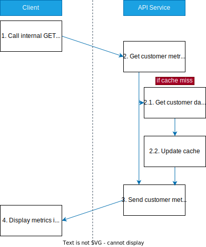
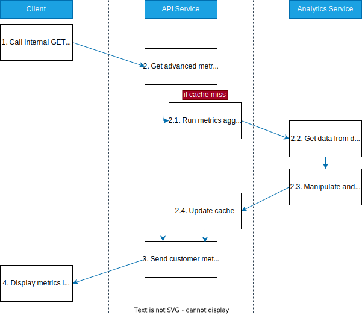
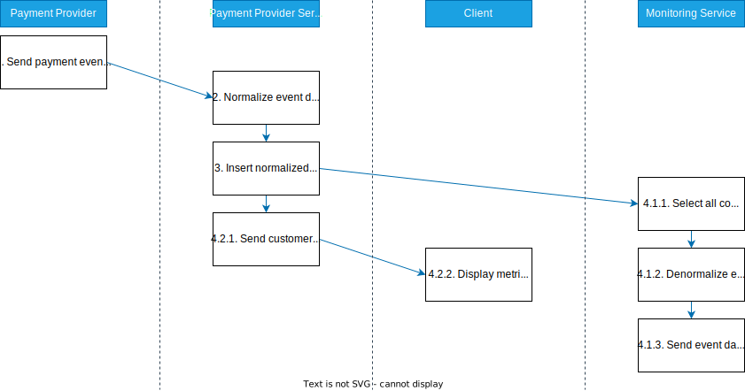
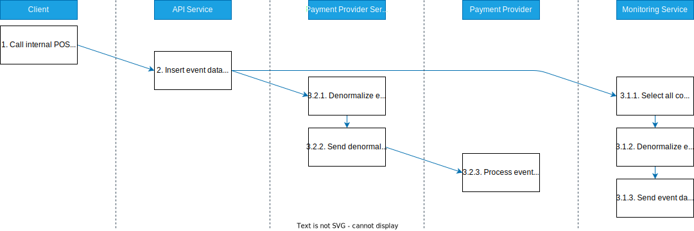

# Database

First the normalized database tables should be designed. We'll start with **CUSTOMERS** and **CUSTOMER_PAYMENT_EVENTS**, to keep track of all customers and their current payment **status**, as well as all **events** and its **statuses** to follow up on when a certain subscription was cancelled or reactivated, etc. Because this data is normalized, we also need to have a field for which **payment_provider_type** this data came from. We'll also add a field for the **issuer** of the event, to distinguish if an event was created through our _internal_ system or if it came from a _payment provider_.

## Database Design

**CUSTOMERS**

| id                                   | account_id | payment_provider_type | timestamp            |
| ------------------------------------ | ---------- | --------------------- | -------------------- |
| 2a79f34a-afad-45b4-b47c-0e746dbf050c | 1234567890 | stripe                | 2023‐07‐06T14:22:36Z |
| c2964bba-a1ba-440f-92ca-5aa809a7c4cc | u567890123 | paypal                | 2023‐07‐06T14:22:30Z |

_Table 1: A minimal example of what the database table **CUSTOMER** could look like._

**CUSTOMER_PAYMENT_EVENTS**

| id                                   | type         | account_id | payment_provider_type | status     | issuer           | timestamp            |
| ------------------------------------ | ------------ | ---------- | --------------------- | ---------- | ---------------- | -------------------- |
| 2096449e-3956-47a1-9e2c-dde39130b59a | cancellation | 1234567890 | stripe                | processing | internal         | 2023‐07‐06T14:22:30Z |
| ce568e27-70ee-4160-8584-d7b989aed639 | cancellation | 1234567890 | stripe                | complete   | payment provider | 2023‐07‐06T14:22:36Z |

_Table 2: A minimal example of what the database table **CUSTOMER_PAYMENT_EVENTS** could look like._

# Payment Provider Connectors

## Interface

- Retrieve data handler - Webhook, Polling, On-demand syncing, etc (depending on the capability of the payment provider's API)
- Data normalizer - To adjust incoming data to our internal database structure.
- Send data handler - Sync with the payment provider (the source of truth) e.g. if a reimbursment event was done through our system.
- Data denormalizer - When sending data back to the payment provider, transform to its wanted data structure.

## Functionality

### Update External Payment Provider

1. Denormalize data
2. POST to external payment provider

### Update Internal System

1. Normalize data
2. Update internal database

# Data Processing

Processing millions of customer metrics can be an expensive task. Therefore we want store the result in a cache (e.g. Redis) so we don't have redo the same expensive task whenever another client is fetching for the same metrics.

The important thing to remember is that these are aggregated results, derived from customer metrics, and therefore can easily changed and updated if need be, whereas the integrity of customer metrics (e.g. records in **CUSTOMER_PAYMENT_EVENTS**) should remain intact.

# API

## Functionality

### Call POST customer data endpoint

1. Update internal database

### Call GET Advanced Aggregated Metrics

1. Get advanced aggregated metrics from cache
2. (if cache miss) Run metrics aggregator and update cache
3. Send aggregated metrics to client

### Call GET Single Customer Metrics

1. Get customer metrics from cache
2. (if cache miss) Get customer metrics from database and update cache
3. Send customer metrics to client

# Integrated Monitoring Provider

These are third party apps that want to listen to certain events (e.g. user cancallation failed, user churn). Similar to the payment providers, the monitoring apps need to have their data denormalized when being sent to, and normalized when data being retrieved from.

## Example Monitoring Providers

- Slack
- Webhooks
- Email

## Functionality

### Update Integrated Monitoring Apps

1. SELECT all integrated monitoring apps from database
2. Update each integrated monitoring app

### Update Integrated Monitoring App

1. Denormalize data
2. POST event to external monitoring service

# UI Clients

## Example Clients

- Android
- iOS
- Web

## Functionality

### Update Customer Record

1. Call internal POST customer data endpoint

### Display a Single Customer's Metrics

1. Call internal GET single customer metrics endpoint
2. Display metrics in UI in various charts and tables

### Display Advanced Aggregated Metrics

1. Call internal GET advanced aggregated metrics endpoint
2. Display metrics in UI in various charts and tables

# Data Flow

## Display a Single Customer's Metrics

## Display Advanced Aggregated Metrics

## Handle Payment Provider Customer Event

## Update Customer via Internal Dashboard UI

